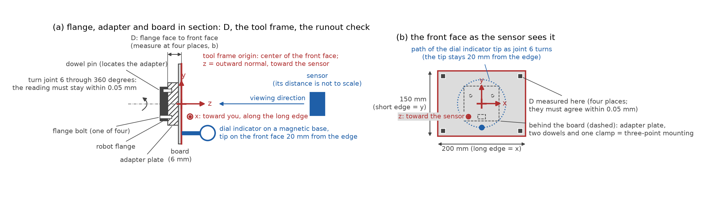
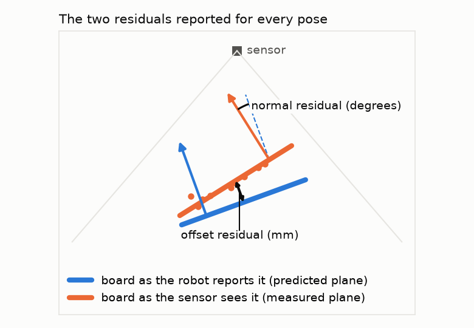
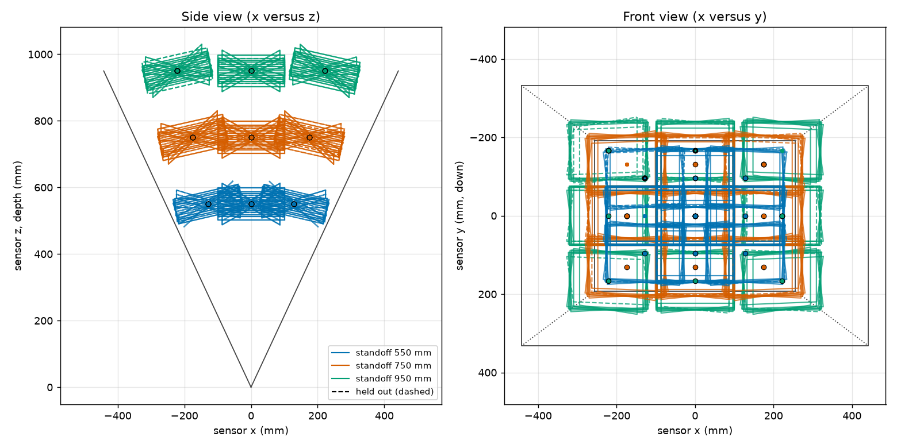
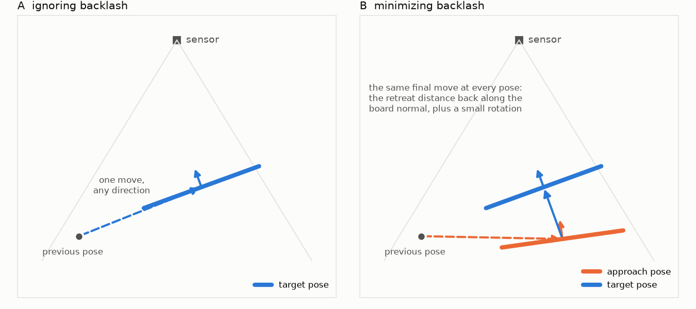

# Registration captures: step-by-step procedure

Audience: the robot technician who will set up the board, program the robot, and
record the captures. No knowledge of the registration math is needed. Two people are
referred to throughout: the technician (you), who sets up the board, programs the
robot and records the captures; and the engineer, who runs the analysis and answers
questions about the setup. Where a step says "run", a computer with Python and this
repository is needed (appendix C says how to set it up); the engineer can run those
steps for you if you send the files.

What you are producing: two folders of sensor capture files (`.mc`), one group of
files per robot pose, each folder with a small table (the manifest) that says, for
every file, exactly where the robot had put the board. The two folders come from the
same list of poses, driven in two different ways (section 6): one ignoring the
robot's gear backlash and one trying to make its effect the same at every pose. The
registration software works out from each folder where the sensor is relative to
the robot, and the engineer compares the two. If the table is wrong, the
registration is wrong, so most of this procedure is about getting the table right.

This procedure follows the stage-1 calibration capture procedure of the depth
calibration project (repository `depth_calibration_from_spherical_target`, file
`docs/procedures/stage1_capture_procedure.docx`; "the stage-1 procedure" below) in
its layout and its tools. The board, its adapter, its tool frame and the run-out
fixture are the stage-1 ones, reused; section 1 lists them, and carries their
specification, drawing and suppliers so that they can be made if the stage-1 session
has not been run. The spheres and the three-ball nest are not needed here. You do
not need to have read the stage-1 procedure; where this document points to it, it is
for extra detail only.

Terminology: in this project "registration" means finding the transform between the
sensor and the robot (the extrinsic parameters); "calibration" means finding the
sensor's own internal parameters. This procedure is about registration only.

Figures: figure 1 (section 3) shows the board on the flange and its tool frame;
figure 2 (section 4) shows the two numbers the software reports for every pose;
figure 3 (section 5) shows an example pose plan; figure 4 (section 6) shows the two
ways of driving to a pose.

---

## 1. Scope of work and equipment

This section is the complete list of what must exist before the first session: what
is already in hand, what must be built, what must be bought, and what must be
prepared. Nothing outside this list is needed. The board, its adapter and the run-out
fixture come from the stage-1 session; 1b to 1e say what they are, so that they can
be made for this procedure alone if stage 1 has not been run. Appendix D holds the
shop drawing; appendix A lists suppliers.

### 1a. Already in hand

| Item | Requirement |
|---|---|
| Sensor | The 3D sensor to be registered: the same depth sensor as in stage 1, with the same processing settings (1f) |
| Robot | Six-axis industrial robot with an ISO 9409-1-50-4-M6 tool flange; its documented absolute positioning accuracy must be 0.1 mm or better over the working volume (check the maker's specification sheet; repeatability alone is not enough) |
| Capture computer and software | Runs the sensor's capture and communication software, which accepts the capture trigger from the robot program and writes one `.mc` file per capture, named by pose id (section 2); at least 10 GB free per 1,000 frames, about 25 GB for the default plan |
| Analysis computer | Any computer with Python 3.10 or later and the two software packages installed, their self-test passed (appendix C) |
| Flat target (board) | From stage 1: 200 x 150 mm plate, at least 6 mm thick, matte light-gray front face flat to 0.05 mm; specification in 1d |
| Board adapter | From stage 1: plate on the ISO flange with three support pads, three edge pins and three clamp fingers, holding the board square to the flange axis and centered on it; drawing SC1-05 (appendix D) |
| Run-out fixture | From stage 1: dial indicator on a magnetic base on a steel plate bolted to the cell table; section 1e |
| Rigid sensor mount | From stage 1, built from the existing drawing from previous work: a stiff bracket, not a tripod, with the sensor's position marked so a bump is noticed |

### 1b. What must be built

Nothing, if the stage-1 session has been run: the three items below exist. Otherwise
they are built as in the stage-1 procedure, to the same drawing and specification.

| Item | Quantity | Drawing | Estimated cost (USD) | From stage 1 |
|---|---|---|---|---|
| Flat target (board) | 1 | SC1-05 (outline) | $50 to $400 | yes |
| Board adapter | 1 | SC1-05 | $250 to $600 | yes |
| Run-out fixture | 1 | none needed | $240 to $570 | yes |

The rigid sensor mount is built from the existing drawing from previous work and is
not estimated here.

### 1c. What must be bought

| Item | Purpose | Estimated cost (USD) | From stage 1 |
|---|---|---|---|
| Calipers with depth rod, 150 mm | Board distance D; board size | $30 to $150 | yes |
| Precision straightedge, 300 mm, and feeler gauges | Board flatness after painting and mounting | $75 to $240 | yes |
| Thermometer | Room temperature in the session notes | $15 to $40 | yes |
| Machinist's square | Board x axis against the adapter when the tool frame is set | $30 to $80 | yes |
| Consumables | Isopropyl alcohol and wipes, shim stock for the adapter | $20 to $60 | no |
| Phone camera | Setup photos for the deliverables (section 9) | in hand | yes |

Cost estimates (October 2026): if the stage-1 session has been run, everything above is in hand and the new spending is $20 to $60 for consumables. Built from nothing, the items come to $540 to $1,570 to build and $170 to $570 to buy, $710 to $2,140 in all. The figures are the stage-1 procedure's, from suppliers' list prices where these exist (appendix A) and otherwise from typical United States job-shop rates of about $80 to $150 per hour. Treat them as plus or minus 50 percent and get quotes; the board adapter is the least certain figure.

### 1d. Purchase specification for the flat plate

| Requirement | Flat plate (board) |
|---|---|
| Size | 200 x 150 mm, at least 6 mm thick |
| Material | Ground aluminum tooling plate (for example MIC-6, finish-ground) or float glass |
| Flatness | 0.05 mm over the front face, checked with the straightedge and a 0.05 mm feeler leaf after painting and after mounting on the board adapter |
| Front face | Matte light-gray paint, thin and even; do not bead-blast a plate thinner than about 10 mm, since peening one face bows it. Thickness is not a stiffness matter (a 6 mm plate sags about 0.002 mm under its own weight); it only has to survive the finish and the mounting flat |
| Edges | Square and clean on the bottom long edge and the left short edge, which rest against the board adapter's edge pins |
| Documents | Supplier's flatness report, kept with the session notes |

### 1e. Run-out fixture: dial indicator and its mounting

The run-out check of section 3 needs the dial indicator held still while the robot
turns the board (figure 1). Use a dial indicator with 0.01 mm graduation and about
10 mm travel (for example Mitutoyo 2046 series, about $50 to $150) on an articulating
magnetic base with fine adjustment (for example Noga MG71003 or DG-61003, about $140
to $320). Stand the magnetic base on a steel base plate about 150 x 100 x 12 mm bolted
to the cell table with two M8 screws, so the base holds on a non-magnetic table and
does not creep. Place the plate where the indicator tip reaches the board's front
face about 20 mm from an edge with the robot in its run-out pose. McMaster-Carr and
the usual tool suppliers stock all three items. The stage-1 fixture serves as it is.

### 1f. Preparation before the first session

Robot:

- Check the robot's documented absolute-accuracy specification: 0.1 mm or better
  over the working volume.
- Weigh the board with its adapter and enter its tool load data (mass and center of
  gravity) in the controller; wrong load data shifts every pose.
- Write the robot program to the interface of sections 6 and 7: it reads
  `plan/poses.csv`, drives each pose in the way its sub-procedure requires, triggers
  the captures through the capture computer's communication software, and writes
  `pose_log_A.csv` and `pose_log_B.csv`. Note where the program writes the pose logs
  (controller storage or a network location) so they can be collected after the
  session. Once the robot model and controller are settled, the program can be
  written with Claude Code.
- Dry-run every planned pose at reduced speed, without capturing, in both
  sub-procedures: the straight moves of A and the approach-then-final moves of B. Each
  pose must be reachable and must clear the sensor, its mount and its cables.
- Review the new program under the cell's safety rules.

Sensor and computers:

- Set up the capture software for the robot's trigger and the `<pose_id>_Index<nn>`
  file names (section 2); writing the robot pose into the file header is optional
  (section 7).
- Choose and record the production exposure and gain, and the SGM (semi-global
  matching) parameters: all smoothing filters off, and the patch size the same as in
  installations. These are the stage-1 settings.
- Free at least 25 GB on the capture computer: the default plan is about 2,350
  frames, at 10 GB per 1,000 frames.
- Install the two software packages on the analysis computer and pass the self-test
  (appendix C).

Cell:

- Layout study: place the sensor so that board centers at 550 to 950 mm from it, over
  half of its field of view and tilted up to 30 degrees in four directions (section
  5), lie inside the robot's reach, and so that the 40 mm approach retreat of
  sub-procedure B stays clear of the sensor; do this before the sensor mount is
  fixed.
- Bolt the run-out base plate to the cell table (two M8) where section 1e says.
- Identify and record the robot base frame used for the session.

Appendix B lists the software tools used in sections 4 to 8 and their options;
appendix C says how to install them.

## 2. Before anything else

**Words used throughout.** A *capture* is one shot of the sensor; it produces one
*frame* of 3D points, stored as one `.mc` file. Several captures are taken at each
robot position without moving the robot (five per pose in the plan of section 5),
so one pose gives several files. A *pose* is one position and orientation of the
board; every pose has a short name, its *pose id* (for example `boot01` or
`b_z0650_t24_a090_05`), which appears in the robot program, in the pose log and in
the file names. The board's *normal* is the direction perpendicular to its front
face, pointing out of the face toward the sensor. The *pose log* is the text table in
which the robot program records the pose it reached (section 7), and the *manifest*
is the table the software builds from the pose log and the capture files.

**The session folder.** Make one working folder for the session (for example
`reg_2026-10-05/`) and keep everything in it:

- `session_notes.txt` (below);
- `boot/` for the six captures of section 4, with `boot_pose_log.csv` and
  `boot.json` next to it;
- `plan/` for the pose plan of section 5;
- `captures_A/` and `captures_B/` for the two capture runs of section 6, with
  `pose_log_A.csv` and `pose_log_B.csv` next to them.

Every command in this document is typed in that folder and names files relative to
it.

**File names.** Each capture file must be named `<pose_id>_Index<nn>.mc`, where
`pose_id` is the id of the pose it was taken at and `nn` counts the frames of that
pose from 00 (`boot01_Index00.mc`; `b_z0650_t24_a090_05_Index00.mc` to
`..._Index04.mc`). Set the capture software's file-name prefix to the pose id
before each pose, or, if the software insists on its own names, rename the files
afterwards, before building the manifest. A file that is not named this way cannot
be matched to a pose and is left out.

**Sensor.** Switch the sensor on and leave it running for at least 30 minutes before
the first capture, and leave it running for the whole session. Note the time it was
switched on.

Fix the sensor's exposure and gain to the values that will be used in production,
and set the SGM (semi-global matching) parameters as in stage 1: all smoothing filters
off, and the patch size the same as in installations. Write them down. Do not use
automatic exposure.

Switch off or block any sunlight or lamps that fall on the board. Room light is fine
if it is constant.

**Robot.** Confirm with the engineer what the robot base frame is (which frame the
robot's position readout is in). Every pose in this procedure is recorded in that
frame. Do not change the active base frame during the session.

Leave the controller's backlash compensation (if it has such a setting) exactly as it
is in production, and write down what it is set to. Do not change it between the two
sub-procedures of section 6.

**Session notes.** Record in a text file (`session_notes.txt`): date, sensor serial
number, exposure, gain and SGM parameters, robot model and controller software
version, the active base frame name, where the robot program writes the pose logs,
the backlash compensation setting, the board certificate (flatness), room
temperature, and anything unusual.

**Software.** Before the first command of section 4, do appendix C once on the
computer that will run the tools: install the two packages and run the self-test.
Every command in this document is then typed in a terminal opened in the session
folder, with the environment of appendix C.4 active (the prompt starts with
`(.venv)`). The table below is the whole of what gets run, in order; each row points
to the section that gives the full command and explains its output. Any row can be
run by the engineer instead, if you send the files it reads.

| When | Command | Reads | Writes | Section |
|---|---|---|---|---|
| Once, before section 4 | install and self-test | the two repositories | the environment `.venv` | appendix C |
| After the six boot captures | `sphcal.cli.make_manifest` | `boot_pose_log.csv`, `boot/` | `boot/manifest.csv` | 4, step 4 |
| Right after that | `planereg.capture.bootstrap` | `boot/manifest.csv` | `boot.json` (rough sensor position) | 4, step 4 |
| Before programming the robot | `planereg.capture.plan_poses` | `boot.json`, one boot capture | `plan/poses.csv`, `plan_summary.txt`, `plan.png` | 5 |
| After each sub-procedure (A, then B) | `sphcal.cli.make_manifest` | `pose_log_A.csv`, `captures_A/` (same for B) | `captures_A/manifest.csv` | 7 |
| Right after that, board still mounted | `planereg.capture.check_captures` | the manifest, `boot.json`, the pose log | `captures_A/check.json` and a verdict | 8 |

Each command is run as `python3 -m <command> <options>`; the sections give the
options.

## 3. Mounting the board and its tool frame

The board's "tool frame" is a coordinate frame at the center of the board's front
face, with its z axis pointing straight out of the face (along the board's normal,
toward the sensor when the board faces it), x along the long edge, y along the short
edge. The robot must report the board's pose in this frame. This is the same frame
as TOOL_BOARD of the stage-1 procedure; if it is already defined on this robot with
this board and adapter, check it (steps 2 and 3) and reuse it. Figure 1 shows the
parts, the measurements of steps 2 and 3, and the tool frame.



Figure 1. (a) The flange, the doweled adapter plate and the board in section, with
the distance D from the flange face to the board's front face, the tool frame at the
center of the front face (z out of the face toward the sensor, x along the long edge)
and the dial indicator of the runout check. (b) The front face as the sensor sees it:
the tool frame axes, the path of the indicator tip while joint 6 turns, the four
places where D is measured, and the three-point mounting hidden behind the board.

1. Mount the board adapter and the board on the flange with the dowel pins.
2. Runout check (figure 1a): fix the dial indicator to the table with its tip on the board's
   front face about 20 mm from an edge. Slowly rotate the flange about its own axis
   (robot joint 6) through 360 degrees. The reading must stay within 0.05 mm. If it
   does not, the board face is not perpendicular to the flange axis: shim the adapter
   and repeat.
3. Measure the distance from the flange face to the board's front face with a depth
   gauge or calipers at four places around the board (figure 1b); they should agree
   within 0.05 mm. Record the average as D.
4. Measure the board's width and height with calipers and record them. The
   half-sizes go in the pose log (100 and 75 mm for the recommended board).
5. Define the tool frame in the robot (figure 1): position (0, 0, D) from the
   flange, orientation: z along the flange axis pointing out of the board, x along
   the board's long edge. How to set x: with the robot's "tool orientation by points" function,
   teach a point at the center of the long edge, or enter the rotation about z that
   aligns x with the long edge, after measuring with a square against the adapter.
   An error of a few degrees in x is harmless (the board is symmetric); an error in z
   is not.
6. Save as TOOL_BOARD and write the numbers in the session notes.

If the controller cannot define a tool frame and can only report the flange pose,
log the flange pose instead and write "flange pose logged, D = ... mm" in the session
notes. The software then has to move every logged pose forward by D along the
flange's z axis: add `--target-offset-mm D` (D in millimeters) to every bootstrap and
check command in sections 4 and 8, and the engineer adds it to the analysis. Do not
mix the two kinds of pose in one session.

**Remount check.** The three-point mounting is meant to put the board back in the
same place, but that is verified, not assumed. What a remount can change, and what
it does to the registration: a tilt of the face relative to the flange axis shifts
the normal of every pose; a change of D shifts every plane and is absorbed into the
registered translation, where it goes unnoticed unless D is measured again; a shift
or rotation of the board within its own plane changes nothing, because the plane is
the same plane. After any remount of the board or the adapter, therefore:

1. Repeat the run-out check (step 2) and the four D measurements (step 3). Accept
   when the run-out stays within 0.05 mm and the mean D is within 0.05 mm of the
   recorded value. If D has moved by more, find out why (a chip under a pad, an
   unseated dowel) before going on; if the new value is right, update TOOL_BOARD and
   write both values and the time in the session notes, because pose logs written
   before and after refer to different frames otherwise.
2. Repeat the reference capture: the first bootstrap pose of section 4, `boot01`, is
   saved on the controller as a named position for this purpose. Drive to it again,
   capture once as `boot01r` (or `boot01r2` for a second remount) with the same
   logged pose, rebuild the boot manifest and run the bootstrap again (section 4,
   step 4). The two rows `boot01` and `boot01r` were taken at the same robot pose,
   so any difference between their normal and offset residuals is the remount. Accept
   when they agree within 0.2 degrees and 0.2 mm, the plane-noise figures the plan
   assumes (section 5); a difference of a degree or a millimeter means the board did
   not go back. These limits are placeholders until the first session gives real
   figures.
3. Record the remount in the session notes: when, why, the run-out reading, the new
   D, and the two residual rows. A remount between sub-procedures A and B must be
   recorded in any case, because the comparison of the two folders assumes an
   unchanged board.

## 4. Finding where the sensor is (rough)

The software works out the exact position of the sensor from the captures. It only
needs a rough idea first, so that the planned poses land in the sensor's field of
view and so that the software knows where to look for the board in each capture.
This step takes six captures of the board at hand-chosen poses.

**What the software does with a capture, and the words it uses.** In every capture
it looks for the board (*segmentation*: finding the flat patch of points that is the
board, among whatever else is in view) and fits a plane to those points. How far the
points scatter about that plane is the *plane residual* (in mm; a clean matte board
gives a fraction of a millimeter). From the logged robot pose and the current idea
of where the sensor is, it also *predicts* where the board plane should be in the
sensor's view. The difference between the predicted plane and the measured plane is
reported as two numbers (figure 2): the *normal residual*, the angle between the two
planes in degrees, and the *offset residual*, the distance between them at the
board's center in millimeters. Once the sensor's position has been solved from all
the poses together, the two residuals of each pose say how well that pose agrees
with the solution; a pose whose robot position was logged wrongly stands out by a
large residual. The *valid fraction* of a pose is the share of its frames in which
the board was found.



Figure 2. The two residuals reported for every pose: the angle between the board as
the robot reports it and the board as the sensor sees it (normal residual), and the
distance between the two planes at the board's center (offset residual).

The steps. Directions such as "top edge" and "left edge" mean the edge nearest the
top or the left of the sensor's picture as the capture software shows it. If the
software has no live view, take a capture and open it in the software's viewer, or
send the first file to the engineer, to see which way is up.

1. Create the folder `boot/`. With TOOL_BOARD active, jog the board to a point
   roughly in front of the sensor, about 600 mm away, near the middle of the picture,
   facing the sensor squarely. Check on the capture computer's live view that the
   whole board is visible with margin and that nothing else flat and large is closer
   to the sensor than the board (a tabletop between the sensor and the board, for
   instance, must be out of the picture or farther away than the board).
2. Record one capture into `boot/` as `boot01_Index00.mc`. Read the robot's reported
   tool pose (position and orientation, in the base frame) from the pendant and
   write it as the first pose line of `boot_pose_log.csv`, in the format of
   section 7 (read section 7 now: the file needs a header line, and one line per
   pose with the pose id `boot01`, the board half-sizes, the position and the
   orientation in the form your controller shows). The joint-angle columns are not
   needed for these six poses. Save this robot position on the controller under a
   name such as `REF_BOARD`: it is the reference pose of the remount check (section
   3), to be driven to again after any remount.
3. Tilt the board about 20 degrees so that its top edge comes toward the sensor,
   keeping its center near the middle of the picture; capture `boot02` and log the
   pose. Then about 20 degrees the other way, bottom edge toward the sensor
   (`boot03`); then 20 degrees with the left edge toward the sensor (`boot04`); then
   the right edge (`boot05`). Finally move the board about 250 mm farther from the
   sensor, facing it squarely (`boot06`). Six poses, tilted in four directions and
   at two distances, one capture each.
4. Build the manifest and run the bootstrap (section 2 says where to type this):

```
python3 -m sphcal.cli.make_manifest --pose-log boot_pose_log.csv \
    --captures boot/ --format csv --out boot/manifest.csv
python3 -m planereg.capture.bootstrap --manifest boot/manifest.csv \
    --out boot.json
```

The bootstrap prints one line per pose with the board it found (how many pixels,
how flat), and after solving, each pose's normal and offset residual against the
solution. They should be a fraction of a degree and a millimeter or two at most; a
disagreement of several degrees or tens of millimeters means a pose was copied
wrongly, the tool frame's z axis is wrong (section 3, step 5), or the board was not
the closest flat surface in that capture. It also prints the "normal spread" of the
six poses, a number between 0 and 0.58 that says how differently the board was
tilted from pose to pose: it must be at least 0.05 (the tilts above give about
0.15). `boot.json` is the rough sensor position; the next steps read it.

## 5. The pose plan

The plan is the list of board poses the robot will visit. It is made by a program,
the plan tool, from the rough sensor position of section 4, the sensor's field of
view (read from one of the bootstrap captures) and the measured board half-sizes.
Three words describe each planned pose:

- the *standoff*: the distance from the sensor to the board's center, measured along
  the sensor's viewing axis (the line out of the middle of the picture);
- the *tilt*: the angle between the board's normal and the sensor's viewing axis; 0
  means the board faces the sensor squarely;
- the *azimuth*: for a tilted board, which edge leans toward the sensor, as an angle
  in the board's own plane: 0 is the top edge toward the sensor, 90 the right edge,
  180 the bottom edge, 270 the left edge ("top" and "left" as in the sensor's
  picture, section 4).

Run the plan tool:

```
python3 -m planereg.capture.plan_poses --sensor-in-base boot.json \
    --camera boot/boot01_Index00.mc --board-half-size-mm 100 75 --out plan/
```

(Use your board's half-sizes in place of 100 75.) It writes three files: the pose
list `plan/poses.csv` for the robot program, a report `plan/plan_summary.txt`
(explained below), and a picture `plan/plan.png` (figure 3 shows the picture for the
default settings). The plan with the default settings is:

The board at three standoffs from the sensor (550, 750 and 950 mm), at a 3 x 3 grid
of lateral positions covering 50 percent of the field at each standoff, facing the
sensor and tilted by 0, 15 and 30 degrees, the tilted poses at the four azimuths
(top, right, bottom and left edge toward the sensor): 9 orientations at each of 27
positions. Tilted boards that would leave the field of view are dropped
automatically. About 20 percent of the poses are marked as *held out* in
`poses.csv` (column `holdout`, value 1): capture them like all the others; the
software keeps them aside for checking the result instead of fitting with them.

What the plan tool prints. Besides the three files, the tool prints a plain-text
summary to the screen and saves the same text as `plan/plan_summary.txt`. It is not
something you fill in; it is the tool's report on the plan it just made. The block
below is that report for the default settings, a 640 x 480 sensor and a nominal
sensor position (your own run shows the same layout with your numbers). Read it
before handing the plan to the robot programmer:

- The table gives, for every standoff and tilt, how many poses were planned, how
  many were dropped because a board corner would fall too near the image edge, how
  many are kept, and how many of those are tagged held out. A few dropped poses are
  normal; if a whole row is dropped, the board is too large for that standoff in
  this sensor's field, and the line after the table says which option to change.
- `normal spread` says how well the tilts cover all directions; the registration
  refuses a set below 0.05. The default plan gives about 0.28. `similarity spread`
  matters only for the optional scale analysis and must exceed 0.01.
- The `predicted ... RMS error` lines are the registration error to expect if the
  sensor's planes are good to 0.2 degrees and 0.2 mm; they are an order of
  magnitude, not a promise. The second quality block repeats the numbers for the
  poses that are not held out, which is the set the engineer fits.
- The last two lines are the size of the job: the number of poses, and the number of
  pose visits and capture files once both sub-procedures (section 6) have been run.
  Check them against the time and disk space available before starting.

Send `plan_summary.txt` to the engineer with the other deliverables (section 9). The
example below is also kept as `figures/plan_example_summary.txt`.

```
Registration pose plan
Sensor-to-base transform: matrix from boot.json
Camera: 640 x 480 px, half field 24.9 x 19.2 deg
Board half size: 100 x 75 mm; lateral grid 3 x 3 at fill 0.5; edge margin 10 px
Approach pose: retreat 40 mm along the board's -z, rotation 3 deg about the board's
  x axis

Poses per standoff and tilt:
  standoff_mm tilt_deg  planned  dropped   kept  held out
          550      0.0        9        0      9         3
          550     15.0       36        0     36         9
          550     30.0       36        8     28         4
          750      0.0        9        0      9         1
          750     15.0       36        0     36         9
          750     30.0       36        0     36         5
          950      0.0        9        0      9         0
          950     15.0       36        0     36         7
          950     30.0       36        0     36         9
    8 poses were dropped because a board corner would come within 10 px of the image
    edge; use a smaller --lateral-fill, smaller tilts, a smaller board or larger
    standoffs to keep more of them.

Quality of the plan, all planned poses (235 poses):
  normal spread      0.2850  (registration minimum 0.05)
  similarity spread  0.1306  (registration minimum 0.01)
  predicted rotation RMS error     0.0458 deg
  predicted translation RMS error  0.0458 mm
    (assumed noise: normals 0.2 deg, offsets 0.2 mm; an order of magnitude, good to
    a factor of about two)

Quality of the plan, poses not held out (188 poses):
  normal spread      0.2822  (registration minimum 0.05)
  similarity spread  0.1289  (registration minimum 0.01)
  predicted rotation RMS error     0.0517 deg
  predicted translation RMS error  0.0517 mm
    (assumed noise: normals 0.2 deg, offsets 0.2 mm; an order of magnitude, good to
    a factor of about two)

Largest incidence angle (board normal against the line of sight): 30.0 deg
Total: 235 poses, 47 tagged held out (seed 0).
Both sub-procedures together: 2 x 235 poses = 470 pose visits; x 5 frames = 2350
  capture files.
```

The pose budget. This is the first run: a few hundred poses are enough to find out
whether the robot's pose errors or the sensor's plane errors dominate. The plan
summary gives the registration error to expect from the plan if the sensor's planes
are good to 0.2 degrees and 0.2 mm; if the engineer's analysis of the first run
calls for a larger set, a second run of 1,000 or more poses is planned with
`--target-pose-count`, not before.



Figure 3. The planned board centers for the default settings, in the sensor's frame:
side view (left) and front view (right), with the field of view drawn. One color per
standoff; held-out poses have an outline.

**The columns of `poses.csv`.** Every row is one pose. The robot program needs the
pose id, the target pose, and (for sub-procedure B of section 6) the approach pose;
the other columns are bookkeeping.

| Columns | Meaning |
|---|---|
| `pose_id` | The pose's name; it goes in the pose log and in the file names |
| `kind`, `radius_mm` | Always `board` and empty (the stage-1 tools also plan spheres) |
| `half_width_mm`, `half_height_mm` | The board half-sizes you gave |
| `holdout` | 1 for a held-out pose, 0 otherwise; capture both alike |
| `base_x_mm`, `base_y_mm`, `base_z_mm` | Position of the board tool frame in the base frame, mm |
| `r00` ... `r22` | Its orientation as a 3 x 3 rotation matrix, row by row (`r01` is row 0, column 1) |
| `quat_w`, `quat_x`, `quat_y`, `quat_z` | The same orientation as a unit quaternion, scalar part first (`w` is never negative) |
| `rotvec_x_deg`, `rotvec_y_deg`, `rotvec_z_deg` | The same orientation as a rotation vector: direction = axis, length = angle in degrees |
| `sensor_x_mm`, `sensor_y_mm`, `sensor_z_mm` | The board center as seen from the sensor (for the picture; not needed by the robot) |
| `standoff_mm`, `tilt_deg`, `azimuth_deg` | What the pose was planned as (see above) |
| `approach_x_mm`, `approach_y_mm`, `approach_z_mm` | Position of the **approach pose** for sub-procedure B |
| `approach_r00` ... `approach_r22`, `approach_quat_w` ... `approach_quat_z`, `approach_rotvec_x_deg` ... `approach_rotvec_z_deg` | Its orientation, in the same three forms |

Use whichever orientation form your robot program accepts; all three describe the
same rotation (tool frame to base frame). Hand the file to whoever writes the robot
program, or import it directly if the controller can read CSV.

## 6. The two sub-procedures

Every pose is captured twice, in two separate runs over the whole plan, with the
sensor and the board untouched between them. Figure 4 shows the difference. Read
section 7 (the pose log) before writing the robot program: the program has to write
that file.

**Triggering the captures.** Each robot program outline below has a step "trigger
the capture of 5 frames". The robot program sends that trigger through the capture
computer's communication software, the same path as in stage 1 (section 1f). The
capture is taken after the settling wait and before the robot moves on, and the
file-name prefix for the captures of that pose is the pose id (section 2). The
program is written before the first session (section 1f), once the robot model and
controller are settled; it can be written with Claude Code, because both sides of
its interface are fixed: `poses.csv` coming in (section 5), the trigger, and the pose
log going out (section 7).



Figure 4. Left: sub-procedure A drives straight onto each target pose. Right:
sub-procedure B drives to the approach pose first, then makes the same final move
onto the target at every pose. (The approach rotation is exaggerated in the drawing.)

**Sub-procedure A, "ignoring backlash".** Uses only the target pose of each row of
`poses.csv`; the approach columns are ignored. Robot program outline, for each row:

1. Move to the target pose with one joint move, from wherever the robot is.
2. Wait 1.5 seconds for vibration to settle.
3. Trigger the capture of 5 frames through the communication software; file names
   `<pose_id>_Index00.mc` to `<pose_id>_Index04.mc`, in the folder `captures_A/`.
4. Read the robot's actual reported tool pose (not the commanded one, the reported
   one) and, if the controller gives them, the six joint angles; append them to the
   pose log `pose_log_A.csv` (section 7).
5. Move on.

When the last pose of A is done, and before starting B, build the manifest of
`captures_A/` (section 7) and run the check on it (section 8), while the board is
still mounted and flagged poses can be re-captured cheaply.

**Sub-procedure B, "minimizing backlash".** The idea: gear backlash means the flange
can sit on either side of a small dead band after a move, depending on which way each
joint last moved. Approaching every target pose with the same final move makes the
last motion of each joint the same at every pose, as far as the geometry allows, so
the dead band is taken up the same way each time and its effect is constant instead
of random. The approach pose in the plan is the target pose moved back 40 mm along
the board's own normal (away from the sensor) and turned 3 degrees about the board's
long edge; the final move is therefore the same 40 mm advance and 3 degree turn at
every pose. Robot program outline, for each row:

1. Move to the approach pose with a joint move, from wherever the robot is.
2. Wait 0.5 seconds.
3. Make a linear move onto the target pose, at the same speed for every pose, without
   stopping or reversing on the way. If the controller offers a "fine" or "exact
   stop" positioning mode for the end of a move, use it here and in sub-procedure A
   alike.
4. Wait 1.5 seconds for vibration to settle.
5. Trigger the capture of 5 frames through the communication software; file names
   as above, in the folder `captures_B/`.
6. Read the reported tool pose and, if available, the joint angles at the target,
   and append them to `pose_log_B.csv`; if the controller can also report the joint
   angles at the approach pose, log those in the `approach_j1..approach_j6` columns.
   The check tool uses them to confirm that each joint's final motion had the same
   direction at every pose.
7. Move on.

When the last pose of B is done, build the manifest of `captures_B/` and run the
check on it, as after A.

Use the same speed and acceleration settings in both sub-procedures. Do all of A,
then all of B (or the other way round); do not interleave, and do not move the
sensor or remount the board between them. If a remount cannot be avoided, do the
remount check of section 3 and record it before the second run starts. At about 8 seconds per pose in A and 12 in
B, the robot time for the default plan (section 5 gives the exact pose count) is
about 80 minutes in all; plan on about three hours including the setup and the
checks.

## 7. Recording the poses: the pose log

The capture software writes the sensor data; the robot's pose has to be recorded
separately, by the robot program, in a text table called the pose log. There is one
pose log per capture folder (`boot_pose_log.csv`, `pose_log_A.csv`,
`pose_log_B.csv`). It is a CSV file (comma-separated values, one header line, then
one line per pose) with these columns:

```
pose_id, kind, radius_mm, half_width_mm, half_height_mm,
x_mm, y_mm, z_mm, rotation_type, r1, r2, r3, r4, ..., r9,
j1, j2, j3, j4, j5, j6, approach_j1, ..., approach_j6
```

(one header line in the file; it is broken here only to fit the page)

- `pose_id`: exactly the id from `poses.csv` (or `boot01`..`boot06` in section 4),
  which is also the start of the file names.
- `kind`: `board`. `radius_mm`: empty.
- `half_width_mm`, `half_height_mm`: half the measured board size.
- `x_mm`, `y_mm`, `z_mm`: the reported tool position in the base frame.
- `rotation_type` and `r1..r9`: the reported tool orientation, in whatever form the
  controller gives, named by one of the words in the table below. Only as many r
  columns as the form needs are filled; the header may stop at the last one used
  (`r4` for a quaternion, `r3` for angles, `r9` for a matrix).
- `j1..j6` and `approach_j1..approach_j6`: the joint angles in degrees, if the
  controller reports them; otherwise leave the columns out entirely.

| `rotation_type` | `r1`, `r2`, `r3`, ... | Typical controller |
|---|---|---|
| `quaternion_wxyz` | w, x, y, z | ABB (its quaternion is in this order) |
| `quaternion_xyzw` | x, y, z, w | some vision and ROS systems |
| `euler_zyx_deg` | A, B, C | KUKA (A, B, C in degrees) |
| `fixed_xyz_deg` | W, P, R | FANUC (W, P, R in degrees) |
| `euler_xyz_deg` | a, b, c | controllers reporting X-Y-Z Euler angles |
| `rotvec_deg` | x, y, z (length = angle in degrees) | Universal Robots; its rotation vector is in radians, multiply the three numbers by 57.2958 |
| `matrix` | the 3 x 3 rotation matrix, row by row (9 numbers) | any controller that shows a matrix |

If your controller is not in the table, ask the engineer which word applies; naming
the form wrongly makes every pose disagree with the solution (section 8).

Example line, one line in the file, broken here only to fit the page (the first
part is the pose, the second the six joint angles at the target and the six at the
approach pose):

```
b_z0650_t24_a090_05,board,,100.0,75.0,850.11,-12.70,470.55,euler_zyx_deg,-91.3,19.8,0.4,,
12.1,-35.6,88.2,3.4,41.0,-8.7,11.9,-36.0,88.9,3.1,40.5,-8.4
```

After each sub-procedure, the manifest is built from its pose log and its capture
folder:

```
python3 -m sphcal.cli.make_manifest --pose-log pose_log_A.csv \
    --captures captures_A/ --format csv --out captures_A/manifest.csv
python3 -m sphcal.cli.make_manifest --pose-log pose_log_B.csv \
    --captures captures_B/ --format csv --out captures_B/manifest.csv
```

The tool matches every file to its pose id, converts the orientation to the standard
matrix form, and complains, by name, about any pose without files, any file without
a pose, and any missing size. A `poses.csv` from the plan tool is also accepted
directly as the pose log if your robot program cannot write one; then the commanded
poses stand in for the reported ones, which is acceptable only for a robot with
absolute accuracy better than 0.1 mm, and it defeats the purpose of sub-procedure B.
Extra columns such as the joint angles are carried along unchanged.

Optional extra: if the capture software can be given the robot's pose at capture
time, let it write the pose into each file's header as well, under the key
`robotPose`, as a 4 x 4 matrix (16 numbers, row by row: rotation in the top-left
3 x 3, position in the right column, last row 0 0 0 1), tool frame to base frame.
The engineer can then cross-check the pose log against the headers. It does not
replace the pose log: the tools above read the log.

## 8. Checking the captures before the analysis

Run the quick check on each folder as soon as its captures are complete, while the
robot and the board are still set up:

```
python3 -m planereg.capture.check_captures --manifest captures_A/manifest.csv \
    --sensor-in-base boot.json --pose-log pose_log_A.csv --out captures_A/check.json
python3 -m planereg.capture.check_captures --manifest captures_B/manifest.csv \
    --sensor-in-base boot.json --pose-log pose_log_B.csv --out captures_B/check.json
```

It prints one line per pose and a verdict. Things it flags, and what they mean (the
words are those of section 4):

- Low valid fraction (below 50 percent of frames): the board was not read; check
  exposure, or the board was outside the field.
- Board touching the image border: the board is partly out of view; the pose is
  unusable, re-plan it slightly inward.
- Segmentation failed: the software could not find a flat surface of the board's
  size facing the sensor where the pose says it should be; the pose was copied
  wrongly, or something flat is closer to the sensor than the board (a cable, a
  hand, the table), or the board is outside the field.
- Plane residual above 1 mm: the board surface read by the sensor is not flat to
  the sensor; a shiny spot or a dirty board, or an exposure problem.
- Normal residual above 1 degree or offset residual above 1 mm against the solved
  registration: either the robot pose was copied wrongly for that pose, or, if it
  affects every pose with one tilt direction, the board tool frame's orientation is
  wrong (section 3, step 5), or the rotation type in the pose log is misnamed; or,
  if it grows steadily across the volume, the robot's base frame or its absolute
  accuracy is off.
- Normal spread below 0.05: the tilts were not varied enough (should not happen with
  the plan's defaults).
- Joint sign consistency (sub-procedure B, when joint angles were logged): for each
  joint, the fraction of poses whose final motion had the majority direction. A joint
  far below 100 percent means the approach move did not standardize that joint's
  backlash over part of the workspace; tell the engineer, it affects how the two
  folders are compared.

Re-capture flagged poses after fixing the cause; do not delete the lines from the
log, add corrected lines with a new pose id (for example `b_z0650_t24_a090_05r`). The
check tool's exit code is 0 when nothing is flagged, 1 when something is, and 2 when
it cannot read the manifest.

## 9. Deliverables checklist

- `captures_A/` and `captures_B/` with all `.mc` files, named `<pose_id>_Index<nn>.mc`
- `pose_log_A.csv` and `pose_log_B.csv`, with the joint-angle columns when the
  controller reports them
- `captures_A/manifest.csv` and `captures_B/manifest.csv` produced by `make_manifest`
  without errors
- `captures_A/check.json` and `captures_B/check.json` with no flags, or a note
  explaining each remaining flag
- `plan/poses.csv`, `plan/plan_summary.txt`, `plan/plan.png` as used
- `boot.json`, `boot_pose_log.csv` and the bootstrap captures in `boot/`
- `session_notes.txt` with: sensor serial, warm-up time, exposure, gain and SGM
  parameters, where the pose logs were written, base frame name, backlash
  compensation setting, board D and runout reading, whether the
  flange pose was logged instead of TOOL_BOARD (section 3), board dimensions and
  certificate, TOOL_BOARD values, temperature, robot speed and acceleration
  settings, the order the sub-procedures were run in and their times, and any
  remount with its check (section 3)
- Photos of the setup: sensor mount, the board on the flange, the workspace behind
  the board as the sensor sees it

## 10. Things that spoil a session

- Moving or bumping the sensor. If it happens, everything after it is a new session,
  and both sub-procedures must be repeated.
- Changing exposure, gain, the base frame, the speed settings, or the backlash
  compensation mid-session or between the sub-procedures.
- Using the commanded pose instead of the reported pose in the log.
- A loose adapter, or a remount that did not go back: check the dowels are seated
  and the runout (section 3, step 2) before each sub-procedure, and do the remount
  check of section 3 after any remount.
- Fingerprints or gloss on the board: wipe with isopropyl alcohol; a shiny spot
  returns a bright highlight and a bad read.
- Something flat and large closer to the sensor than the board, in the picture. The
  software looks for the closest large flat surface when it has no better
  information; keep the foreground clear.
- In sub-procedure B, stopping, reversing, or slowing on the final move, or
  approaching some poses without the approach pose. Every pose must get the same
  final move.
- Mixing up the two pose logs, or capturing B into the A folder.

## Appendix A. Suppliers

This list was assembled from the suppliers' web pages in October 2026, for the
stage-1 procedure, and is repeated here for the items this procedure uses. It is a
starting point, not an endorsement: confirm the flatness, the finish and the price
with the supplier before ordering, because catalogs change.

Board:

- McMaster-Carr: MIC-6 cast aluminum tooling plate, sold with mill certificates and
  a stated flatness (about 0.13 mm over the sheet for the thicknesses of interest).
  That is coarser than the 0.05 mm asked for here, so order the plate oversize and
  have a local grinding shop finish-grind the front face flat to 0.05 mm, then
  matte-paint it (bead-blast only a plate 10 mm or thicker; peening one face of a
  thinner plate bows it). Alternatively, ask the grinding shop for a flatness report
  directly.
- Any float-glass or optical-flat supplier (Edmund Optics sells ground and polished
  flats): a 6 to 10 mm float glass plate is flat to better than 0.05 mm over 200 mm
  as delivered; it must be matte-painted on the front face and bonded or clamped to
  the board adapter. Glass is the better choice when no grinding shop is at hand.

Either way the supplier's or the grinding shop's flatness report is the starting
document (1d), and the 0.05 mm is confirmed in-house with the straightedge and
feeler leaf after painting and after mounting, because that is the state the sensor
sees; only the two materials of 1d are specified.

Measuring instruments (section 1c), all stocked by McMaster-Carr, Transcat,
MSI-Viking and the usual tool suppliers:

- Dial indicator: Mitutoyo 2046 series, 0.01 mm graduation, 10 mm travel, about $50
  to $150.
- Magnetic base: Noga MG71003 or DG-61003 with fine adjustment, about $140 to $320.
- Calipers with depth rod, 150 mm: Mitutoyo or Starrett, about $30 to $150.
- Straightedge: 300 mm, DIN 874 grade 0 or better, about $60 to $200, and a feeler
  gauge set with a 0.05 mm leaf, about $15 to $40 (together the $75 to $240 of 1c).

Machine shop: the board adapter and the run-out base plate (drawing SC1-05 in
appendix D for the adapter; the base plate is a plain drilled plate, section 1e).

## Appendix B. Software reference

The tools live in this repository under `python/planereg/` (the `capture` package)
and use the sibling repository `depth_calibration_from_spherical_target` (the `sphcal`
package) for reading the capture files and building the manifest. Every tool prints
its help with `--help`.

Output of `python3 -m planereg.capture.plan_poses --help`:

```
usage: plan_poses.py [-h] --sensor-in-base PATH [--camera PATH]
                     [--fov-deg H V] [--image-size W H]
                     [--board-half-size-mm HALF_WIDTH HALF_HEIGHT]
                     [--standoffs-mm STANDOFFS_MM [STANDOFFS_MM ...]]
                     [--tilts-deg TILTS_DEG [TILTS_DEG ...]]
                     [--azimuths-deg AZIMUTHS_DEG [AZIMUTHS_DEG ...]]
                     [--lateral-fill LATERAL_FILL]
                     [--lateral-positions NX NY]
                     [--edge-margin-px EDGE_MARGIN_PX]
                     [--approach-retreat-mm APPROACH_RETREAT_MM]
                     [--approach-rotation-deg APPROACH_ROTATION_DEG]
                     [--holdout-fraction HOLDOUT_FRACTION] [--seed SEED]
                     [--target-pose-count N]
                     [--noise-normal-deg NOISE_NORMAL_DEG]
                     [--noise-offset-mm NOISE_OFFSET_MM]
                     [--frames-per-pose FRAMES_PER_POSE] --out DIR

Plan the robot poses of a registration session: board poses at several
standoffs, lateral positions, tilts and azimuths, each with an approach
pose for the minimizing-backlash sub-procedure. Writes poses.csv,
plan_summary.txt and plan.png.

options:
  -h, --help            show this help message and exit
  --sensor-in-base PATH
                        JSON with {"matrix": [16 floats, row-major 4x4
                        sensor-to-base]} (the bootstrap tool writes this)
                        or sphcal's {"bootstrap": [{"pose_id", "base_xyz",
                        "sensor_xyz"}, ...]}
  --camera PATH         .mc capture file whose header gives fx, fy, cx, cy
                        and whose array gives the image size
  --fov-deg H V         full horizontal and vertical field of view in
                        degrees (with --image-size)
  --image-size W H      image width and height in pixels
  --board-half-size-mm HALF_WIDTH HALF_HEIGHT
                        half the long edge and half the short edge
                        (default (100.0, 75.0))
  --standoffs-mm STANDOFFS_MM [STANDOFFS_MM ...]
                        sensor-z depths of the board centers (default
                        (550.0, 750.0, 950.0))
  --tilts-deg TILTS_DEG [TILTS_DEG ...]
                        board tilts away from facing the sensor; 0 is
                        planned once per position (default (0.0, 15.0,
                        30.0))
  --azimuths-deg AZIMUTHS_DEG [AZIMUTHS_DEG ...]
                        azimuths of the tilt axis in the board plane: 0
                        tilts the top edge toward the sensor, 90 the right
                        edge, 180 the bottom edge, 270 the left edge
                        (default (0.0, 90.0, 180.0, 270.0))
  --lateral-fill LATERAL_FILL
                        fraction of the half field covered by board
                        centers at each standoff (default 0.5)
  --lateral-positions NX NY
                        board positions across the field: columns and rows
                        (default (3, 3))
  --edge-margin-px EDGE_MARGIN_PX
                        board corners must project this far inside the
                        image (default 10.0)
  --approach-retreat-mm APPROACH_RETREAT_MM
                        retreat of the approach pose along the board's own
                        -z (default 40.0)
  --approach-rotation-deg APPROACH_ROTATION_DEG
                        rotation of the approach pose about the board's
                        own x axis (default 3.0)
  --holdout-fraction HOLDOUT_FRACTION
                        fraction of the poses tagged as held out (default
                        0.2)
  --seed SEED           seed of the random held-out subset
  --target-pose-count N
                        choose the lateral grid so that the plan has about
                        N poses (overrides --lateral-positions)
  --noise-normal-deg NOISE_NORMAL_DEG
                        assumed normal noise for the error prediction
                        (default 0.2)
  --noise-offset-mm NOISE_OFFSET_MM
                        assumed offset noise for the error prediction
                        (default 0.2)
  --frames-per-pose FRAMES_PER_POSE
                        frames captured per pose, for the capture counts
                        (default 5)
  --out DIR             output directory
```

Output of `python3 -m planereg.capture.bootstrap --help`:

```
usage: bootstrap.py [-h] --manifest PATH --out PATH
                    [--min-valid-fraction MIN_VALID_FRACTION]
                    [--border-margin-px BORDER_MARGIN_PX]
                    [--target-offset-mm TARGET_OFFSET_MM]
                    [--min-pose-count MIN_POSE_COUNT]
                    [--min-normal-spread MIN_NORMAL_SPREAD]
                    [--max-rms-normal-deg MAX_RMS_NORMAL_DEG]
                    [--max-rms-offset-mm MAX_RMS_OFFSET_MM]
                    [--max-normal-deg MAX_NORMAL_DEG]
                    [--max-offset-mm MAX_OFFSET_MM]

Find the sensor roughly in the robot base frame from four or more hand-
jogged board captures (manifest made by sphcal's make_manifest): segment
the board in each, register, print the table and the transform, and write
the JSON that the plan tool reads.

options:
  -h, --help            show this help message and exit
  --manifest PATH       manifest CSV or JSON
  --out PATH            JSON file to write
  --min-valid-fraction MIN_VALID_FRACTION
                        a pixel must be valid in this fraction of a pose's
                        frames (default 0.5)
  --border-margin-px BORDER_MARGIN_PX
                        warn when the board mask comes this close to the
                        image border (default 4)
  --target-offset-mm TARGET_OFFSET_MM
                        distance from the logged frame's origin to the
                        board's front face along its +z, in mm; 0 when the
                        logged frame is the board tool frame, the flange-
                        face-to-front-face distance D of the procedure
                        when the flange pose was logged (default 0.0)
  --min-pose-count MIN_POSE_COUNT
                        fewest segmented poses the registration may use
                        (default 4)
  --min-normal-spread MIN_NORMAL_SPREAD
                        smallest accepted spread of the board normals
                        (default 0.05)
  --max-rms-normal-deg MAX_RMS_NORMAL_DEG
                        largest accepted RMS normal residual (default 1.0)
  --max-rms-offset-mm MAX_RMS_OFFSET_MM
                        largest accepted RMS offset residual (default 5.0)
  --max-normal-deg MAX_NORMAL_DEG
                        largest accepted normal residual of a single pose
                        (default 2.0)
  --max-offset-mm MAX_OFFSET_MM
                        largest accepted offset residual of a single pose
                        (default 10.0)
```

Output of `python3 -m planereg.capture.check_captures --help`:

```
usage: check_captures.py [-h] --manifest PATH [--sensor-in-base PATH]
                         [--pose-log PATH]
                         [--plane-rms-warn-mm PLANE_RMS_WARN_MM]
                         [--min-valid-fraction MIN_VALID_FRACTION]
                         [--border-margin-px BORDER_MARGIN_PX]
                         [--target-offset-mm TARGET_OFFSET_MM]
                         [--normal-residual-warn-deg NORMAL_RESIDUAL_WARN_DEG]
                         [--offset-residual-warn-mm OFFSET_RESIDUAL_WARN_MM]
                         [--outlier-rounds OUTLIER_ROUNDS]
                         [--joint-sign-warn-fraction JOINT_SIGN_WARN_FRACTION]
                         [--out PATH]

Quick check of a capture set before the long registration: valid pixels,
border contact of the board mask, plane fit residuals, agreement of each
pose with the registration of the set, conditioning of the set, and (with
a pose log) the joint motion signs.

options:
  -h, --help            show this help message and exit
  --manifest PATH       manifest CSV or JSON
  --sensor-in-base PATH
                        rough sensor-to-base JSON (the bootstrap tool's
                        output); enables the predicted region
  --pose-log PATH       pose log CSV with the joint columns j1..j6 and
                        approach_j1..approach_j6 (optional)
  --plane-rms-warn-mm PLANE_RMS_WARN_MM
                        flag a pose whose plane fit RMS exceeds this
                        (default 1.0)
  --min-valid-fraction MIN_VALID_FRACTION
                        flag a pose valid in a smaller fraction of its
                        frames (default 0.5)
  --border-margin-px BORDER_MARGIN_PX
                        flag a board mask within this many pixels of the
                        border (default 4)
  --target-offset-mm TARGET_OFFSET_MM
                        distance from the logged frame's origin to the
                        board's front face along its +z, in mm; 0 when the
                        logged frame is the board tool frame, the flange-
                        face-to-front-face distance D of the procedure
                        when the flange pose was logged (default 0.0)
  --normal-residual-warn-deg NORMAL_RESIDUAL_WARN_DEG
                        flag a pose whose normal residual exceeds this
                        (default 1.0)
  --offset-residual-warn-mm OFFSET_RESIDUAL_WARN_MM
                        flag a pose whose offset residual exceeds this
                        (default 1.0)
  --outlier-rounds OUTLIER_ROUNDS
                        leave out up to this many poses (the worst per
                        round) from the registration, so that one wrong
                        pose does not flag the others (default 3; 0 keeps
                        every pose)
  --joint-sign-warn-fraction JOINT_SIGN_WARN_FRACTION
                        warn about a joint whose majority-sign fraction is
                        below this (default 0.9)
  --out PATH            write a JSON report here
```

Output of `python3 -m sphcal.cli.make_manifest --help`:

```
usage: make_manifest.py [-h] --pose-log PATH --captures DIR
                        [--format {csv,json}] --out PATH [--strict]

Build the capture manifest from a pose log (CSV) and a directory of .mc
capture files. The poses.csv written by plan_poses is accepted as a pose
log.

options:
  -h, --help           show this help message and exit
  --pose-log PATH      CSV with pose_id, kind, radius_mm, half_width_mm,
                       half_height_mm, x_mm, y_mm, z_mm, rotation_type,
                       r1..r4 (rotation_type: none, quaternion_wxyz,
                       quaternion_xyzw, euler_zyx_deg, euler_xyz_deg,
                       fixed_xyz_deg, rotvec_deg, matrix)
  --captures DIR       directory of .mc files named
                       <pose_id>_Index<frame>.mc
  --format {csv,json}  manifest format
  --out PATH           manifest file to write
  --strict             treat warnings (missing or unmatched captures, non-
                       unit quaternions) as errors
```

## Appendix C. Installing and running the software, step by step

These steps follow appendix C of the stage-1 procedure; the only difference is that
two repositories are installed, `sphcal` first and `planereg` second. Allow about 20
minutes. Nothing here needs administrator rights.

C.1 Install Python 3.10 or newer (stage-1 procedure, appendix C.1).

C.2 Get the code: unzip the two archives the engineer sent, or clone the two
repositories, side by side, somewhere without spaces in the path, for example
`C:\cal\depth_calibration` and `C:\cal\plane_plane_registration` on Windows or
`~/cal/depth_calibration` and `~/cal/plane_plane_registration` on Linux.

C.3 Open a terminal in `plane_plane_registration/python` (stage-1 procedure,
appendix C.3). Check with `dir` (Windows) or `ls` (Linux) that `pyproject.toml` is
listed.

C.4 Make a private Python environment and install both packages into it:

```
python3 -m venv .venv
.venv\Scripts\activate        (Windows)
source .venv/bin/activate     (Linux)
python3 -m pip install -e ../../depth_calibration    (sphcal, by its path)
python3 -m pip install -e ".[figures,test]"
```

The prompt now starts with `(.venv)`; activate it again in every new terminal.

C.5 Run the self-test, still in `plane_plane_registration/python`:

```
python3 -m pytest -q tests/test_capture_tools.py
```

It must end with a line like `N passed in 20s`. Any line containing `FAILED` or
`ERROR` means the installation is not right; copy the whole output into a text file
and send it to the engineer. Do not start capturing until this passes.

C.6 Run the tools as `python3 -m planereg.capture.<tool>` (and
`python3 -m sphcal.cli.make_manifest`) followed by their options, as in sections 4
to 8. With the environment active this works from any folder, so open the terminal
in the session folder of section 2 and give file names relative to it, as the
commands in this document do. A message starting with `ERROR:` means the tool
stopped and wrote nothing; it says what is wrong and which pose or file it concerns.
A message starting with `WARNING:` means the tool finished but something should be
looked at.

C.7 If something goes wrong: the stage-1 procedure's appendix C.7 applies unchanged
(`No module named sphcal` or `No module named planereg` means the environment is not
active or the install step was skipped).

## Appendix D. Shop drawing

One drawing applies to this procedure: SC1-05, the board adapter, from the stage-1
procedure. It shows a plan view and an elevation in section, with every feature
dimensioned and toleranced, the material, the finish and the quantity. Its flange
interface follows ISO 9409-1-50-4-M6 (ISO 9409-1:1996, table 1: 50 mm pitch circle,
31.5 mm H7 centering recess, four M6, one 6 mm H7 pin hole on the pitch circle at
+Xm); confirm it against the chosen robot's flange drawing before machining. The
rigid sensor mount is built from the existing drawing from previous work and is not
repeated here. The run-out fixture needs no drawing (section 1e).

The drawing is generated by a script in the stage-1 repository
(`depth_calibration_from_spherical_target`, folder `docs/procedures/drawings/`;
regenerate with `python3 docs/procedures/drawings/make_all.py` there). The copy in
this repository, `docs/procedures/drawings/SC1-05_board_adapter.png`, is that output
and prints at full size; it is the copy to send to the shop. When the stage-1
drawing changes, copy the regenerated file here.

| Drawing | Part | Quantity | File |
|---|---|---|---|
| SC1-05 | Board adapter, with the board outline | 1 | `drawings/SC1-05_board_adapter.png` |

Points for the machine shop to confirm: the pin and pad positions carry the general
tolerance ISO 2768-mK, which is enough because the board's position within its own
plane does not affect the registration; the flange-face-to-board-face distance D is
a formula of the board thickness, so the measured D of section 3 is what the robot
uses, not the drawing's nominal.


Drawing SC1-05. Board adapter.
