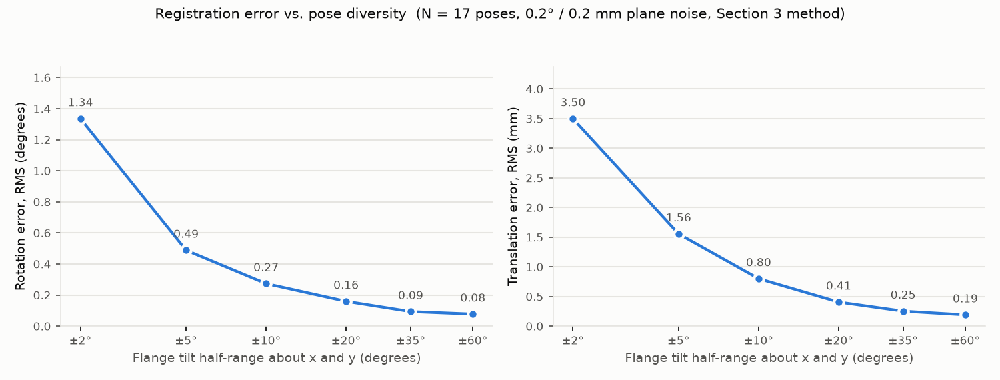

# Review of "Registration to Plane: A Cookbook"

Reviewed document: `RegistrationToPlane.Details.docx`, G. Neil Haven, revision of
16 June 2025 (14 revisions; six listed in the document's own revision table). A copy
of the file and a linear-text extraction of all 36 equations are in `archive/`:

| Item | Local copy |
|---|---|
| the Word document as uploaded | `archive/RegistrationToPlane.Details.docx` |
| body text and equations, Office Math rendered to linear form | `archive/RegistrationToPlane.Details.equations.txt` |
| extraction script | `docs/registration_review/extract_docx_equations.py` |

Equation numbers below are the document's own (its Table of Equations, 1–36).

Every claim marked **[verified]** was checked numerically by
`verify_registration.py` in this directory (NumPy 2.4, SciPy 1.17). The script
builds a synthetic ground truth, generates the sensor-frame plane measurements the
spec assumes, runs both of the spec's solution methods and several deliberately
wrong variants, and prints 30 pass/fail checks. Its output is reproduced in the
appendix. Claims not so marked are from reading.

---

## 1. Summary

**Verdict.** The mathematics is correct. Both solution methods (the linear
12-unknown least squares of Section 2.2 and the rotation-by-SVD plus translation
least squares of Section 3) recover the sensor-to-world transform exactly from
noise-free data, for a plate flush with the flange and for a plate at an arbitrary
known pose on the flange **[verified]**. The plane-transformation rule of Section 4
is correct **[verified]**. Section 3 is the method to implement; Section 2.2 is best
read as its derivation.

The document is, however, not yet a specification an implementer could follow
without guessing. The gaps are not in the algebra but in what the algebra silently
assumes. Ranked by how badly a literal implementation would fail:

1. **The homogeneous scale and sign of the plane coefficients are never pinned
   down.** Equation 7 equates two plane vectors that are each defined only up to a
   nonzero scalar. Both methods silently require every sensor plane to have a unit
   normal with its sign chosen consistently with the flange plane's normal. With
   unnormalized sensor planes the recovered translation is off by hundreds of
   millimeters; with inconsistent signs the rotation is off by up to 180°
   **[verified]**. A sensor's plane-fitting routine does not naturally deliver
   either property. The fix is a two-line convention (Section 5.1 below), but it
   must be in the spec.
2. **The pose series is not characterized.** Nothing says how many poses are needed
   or how they must differ. The problem needs at least three poses whose flange
   normals are linearly independent; translation-only or spin-only pose sets are
   unsolvable, and the registration error falls steeply with the angular range of
   the tilts **[verified]**, so this is the dominant practical factor.
3. **"SVD in the usual way" (Equation 30) must not be the usual point-cloud way.**
   The inputs are direction vectors, not points; a Kabsch routine that subtracts
   centroids, which is what a generic `RigidTransform3D` class would do, is
   measurably worse than the uncentered orthogonal Procrustes solution and its
   translation output is meaningless **[verified]**. Which routine in that class is
   meant, and what it does, needs to be stated.
4. **Equation 28 has a typo** that makes it wrong as printed: `s_y` appears twice
   and `s_z` is missing. Implemented literally the translation is off by nearly a
   meter **[verified]**.
5. **Two definitional questions must be answered before coding:** the direction and
   frame of the robot pose `T_k` (tool-to-base is assumed throughout but never
   stated, and whether "tool" means the bare flange or a configured TCP changes the
   answer), and how the general plate plane `o` is obtained when it is not flush
   with the flange.
6. **The recommended numerical method is weaker than needed.** Section 2.2 forms
   normal equations and a pseudo-inverse; Section 3 says "SVD" without saying of
   what. Section 6 below gives the concrete, better-conditioned computation, which
   is also simpler: the 68×12 system is four copies of one 17×3 system
   **[verified]**, and the translation solve does not depend on the rotation
   estimate at all **[verified]**.

Smaller correctness slips: the transposition statement before Equation 10 writes
`τ14 = τ14 = τ14 = 0` where `τ14 = τ24 = τ34 = 0` is meant; the same sentence calls
`T_k` "the transpose of a rigid transformation" when that describes `Τ_k`; and the
index `k` is reused as the count of poses ("there are k such sets, supplying 4×k
equations"), which is `n` in Section 2 and `N` from Section 2.2 onward.

Nothing in the document covers validation (residuals, acceptance thresholds),
outliers, weighting, or units. For a registration procedure that will run on a
real robot cell those are not optional, and Section 5 lists what is needed.

---

## 2. Notation used in this review

I keep the spec's symbols where they are unambiguous and replace the two that are
not:

| Spec | Here | Meaning |
|---|---|---|
| `X` | `X = [R s; 0 1]` | sensor → world (robot base) rigid transform, Equation 6 |
| `T_k` | `T_k = [R_k t_k; 0 1]` | pose k of the tool frame in the world frame (tool → world; see Section 5.3) |
| `o = (a_o, b_o, c_o, d_o)` | `o` | the plate plane in tool coordinates; `(0,0,1,0)` when flush with the flange |
| `p_k^s = (a_k, b_k, c_k, d_k)` | `(n_k, d_k)` | plane k measured by the sensor, in sensor coordinates; `n_k` is its normal |
| `Τ_k · o` (Greek capital tau) | `(m_k, e_k)` | the plate plane at pose k in world coordinates; `m_k = R_k n_o` is its normal |
| `Ξ = (X^{-1})^t` | `Ξ` | the plane-transform matrix, Equation 12 |
| `(t_1, t_2, t_3, t_4)_k` | `(m_k, e_k)` | Equation 24; identical to the row above |

Plane convention, as in the spec: a plane is `v = (a, b, c, d)` and a point
`p = (x, y, z, 1)` lies on it when `v · p = 0`. When `|(a,b,c)| = 1`, `v · p` is the
signed distance of `p` from the plane, positive on the side the normal points to,
and `d` is the signed distance of the origin from the plane with the opposite sign
convention (the origin is on the positive side when `d > 0`).

One identity does all the work. For a rigid `T = [R t; 0 1]`:

    (T^{-1})^t = [ R        0 ]
                 [ -t^t R   1 ]

so a plane `(n, d)` transforms to `(R n, d - t · (R n))` **[verified, check 1b]**.
The normal rotates, its length is preserved **[verified, check 1c]**, and the
offset shifts by the component of the translation along the new normal.

---

## 3. Specification: clarity

The document is readable, and the step-by-step expansion from Equation 7 to the
explicit 68×12 matrix of Equation 21 leaves no doubt about what the linear system
is. Still, several things cost a reader time or invite error:

1. **Scope and deliverable are not stated.** There is no statement of inputs,
   outputs, assumptions, or which of the two methods is the one to implement.
   Section 3 is titled "A Numerically Superior Method" and ends with a QED, but
   Section 2.2 has the only step-by-step procedure (Table 1). An implementer could
   reasonably build either. A one-paragraph "Problem statement" and a procedure
   table for Section 3 would fix this.

2. **`T` and `Τ` are typographically identical.** The pose `T_k` (Latin) and its
   inverse transpose `Τ_k` (Greek capital tau) differ only in font. In the sentence
   before Equation 10 the two are already confused ("`T_k` is the transpose of a
   rigid transformation"). Suggest `W_k` or `T̃_k` for the plane-transform matrix,
   and likewise a name other than `Ξ` versus `ξ` for the matrix and its vectorized
   unknowns is fine as is, since those two are visually distinct.

3. **The phrase "normal equations" is used for the design equations.** Equations
   8–11, 19 and 21 are called normal equations, but they are the observation
   equations `P ξ = τ`; the normal equations are `PᵗP ξ = Pᵗτ` (Equation 22 forms
   them). This matters because an implementer told to "create the matrix of normal
   equations" (Table 1, step 1) may build `PᵗP`, which is exactly the
   conditioning-squaring step to avoid.

4. **Symbol reuse.** `p` is the plane in Section 1 and Section 4 but also the
   point `p_i`; `k` is the pose index and, once, the pose count; the count is `n`
   in Section 2 and `N` afterward; `s` is both the sensor-frame superscript and the
   translation vector of `X`. The double subscripts `τ_{11_k}` render in Word as
   `τ11k` and are easy to misread.

5. **Equation 26 and 27 use `∘` (Hadamard product) for what is a dot product**, and
   Equation 26 switches between `·` and `∘` mid-derivation. Equation 28 then writes
   the dot product out and introduces the `s_y`/`s_z` typo.

6. **"Numerically superior" is a misnomer.** Section 3's advantage over Section 2.2
   is that it enforces the rotation-matrix constraint; conditioning is the same
   (both reduce to the same 17×3 matrix, Section 6). Calling it "the constrained
   method" or "the rigid method" says what it is.

7. **Sections 2.1 and 2.2 are in the wrong order.** "Interpreting the Results"
   precedes "Setup the Solution".

8. **The thickness `σ` of Equation 3** is really the offset of the measured face
   from the flange face along the flange normal; "thickness" is right only if the
   plate is flush on its back face and the sensor sees its front face. The sign of
   `σ` depends on which way the flange `+z` points, which the document does not
   say (see Section 5.3).

9. **Equation 7 is the heart of the document and is stated without its two
   preconditions** (unit normals, consistent orientation). See Section 4.2.

---

## 4. Specification: correctness, section by section

### 4.1 Section 1 (Equations 1–5) and Section 4 (Equations 33–36): plane algebra

Correct. The derivation in Equation 35 (insert `T^{-1}T`, regroup, transpose) is the
standard argument and gives `p' = (T^{-1})ᵗ p` for points transformed by `T`.
Numerically, three points on a random plane, pushed through a random rigid
transform, lie on the transformed plane to 3e-14 **[verified, check 1a]**.

One thing the derivation proves but the text does not say: the result is only
"a plane whose points satisfy the new equation", i.e. a plane vector up to scale.
`(T^{-1})ᵗ` happens to preserve the normal's length for a rigid `T`
**[verified, check 1c]**, so if the input is normalized the output is too. That is
the property Equation 7 depends on.

### 4.2 Section 2, Equation 7: the correspondence equation

`(X^{-1})ᵗ p_k^s = (T_k^{-1})ᵗ o` says: the plane the sensor measured, pushed into
world coordinates, is the plate plane at pose k, pushed into world coordinates.
Correct as a statement about planes, with two conditions the spec must add:

- **Scale.** Each side is a homogeneous plane vector. Equality as vectors holds
  only when both sides have normals of the same length. Since `o` is given with a
  unit normal (`(0,0,1,0)` or a normalized general plane) and `(T_k^{-1})ᵗ`
  preserves length, the condition is: **every sensor plane must be normalized to
  `|n_k| = 1` before use**. With random scale factors in `[0.5, 2]` on the sensor
  planes the Section 2.2 method's translation is wrong by 452 mm and the Section 3
  method's by 391 mm, with the rotation unaffected in Section 3 (the Procrustes
  step is scale-invariant) **[verified, check 4a, 4b]**.
- **Sign.** `(n, d)` and `(-n, -d)` are the same plane. A sensor plane fit from a
  point cloud (an SVD null vector, say) has an arbitrary sign. If signs are mixed
  the Section 3 rotation comes out 180° wrong in the test **[verified, check 4c]**.
  The required convention is that the sensor normal and the plate normal `o`
  point to the same side of the physical plate. Section 5.1 gives a rule that is
  checkable at run time.

With both conditions met, Equation 7 holds to 1e-14 for both the flush plate and
an arbitrary plate **[verified, check 3a]**.

Equation 7 also assumes `T_k` maps tool coordinates to world coordinates. That is
the usual meaning of a robot controller's reported pose, but it is an assumption
(Section 5.3).

### 4.3 Section 2, Equations 8–11: expansion into 12 unknowns

Correct, given 4.2. The structural claim that `Ξ = (X^{-1})ᵗ` has
`ξ14 = ξ24 = ξ34 = 0` and `ξ44 = 1` is right **[verified, check 2a]**; from the
identity in Section 2 above the top-left block of `Ξ` is `R` itself (not `R⁻¹`)
and the bottom row is `-sᵗR` **[verified, checks 2b, 2c]**. The spec never says
what the 12 unknowns are in terms of `R` and `s`; saying so makes Section 3's
derivation one line.

Slips in this section:

- The sentence before Equation 10 says `τ14_k = τ14_k = τ14_k = 0`; it should be
  `τ14 = τ24 = τ34 = 0`. The same sentence says "`T_k` is the transpose of a rigid
  transformation"; `T_k` is a rigid transformation and `Τ_k = (T_k^{-1})ᵗ` is the
  transpose of one.
- "There are `k` such sets, supplying `4×k` equations": the count is `n` (or `N`).

### 4.4 Section 2.2, Equations 13–23: the linear least-squares setup

The matrix `P` and vectors `ξ`, `τ` are written out correctly, and the method
recovers `X` exactly from noise-free data **[verified, check 3b]**. Three
observations:

- **The 68×12 system is four independent copies of one 17×3 system.** Row block
  `i` of Equation 21 involves only unknowns `ξ_{i1}, ξ_{i2}, ξ_{i3}` and its
  coefficient rows are the sensor normals `n_kᵗ`, the same for all four blocks.
  Solving `A y_i = b_i` four times with `A = [n_1ᵗ; …; n_Nᵗ]` (one factorization,
  four right-hand sides) gives the identical answer **[verified, check 3d]** with
  1/16 of the arithmetic and no 68×12 matrix to build. This also shows that the
  rotation rows (blocks 1–3) and the translation row (block 4) never interact, so
  mixing dimensionless normal residuals with millimeter offset residuals in one
  least-squares problem is harmless here.
- **Equation 22's `(PᵗP)^{-1}Pᵗ` squares the condition number.** Use a QR or SVD
  solve (Eigen's `ColPivHouseholderQR` or `JacobiSVD`, LAPACK `gelsd`), or for
  the 3×3 case simply the 4-RHS QR above. For well-spread poses `cond(P)` is
  about 3, so in practice either works; for poorly spread poses the squared
  condition number is where the damage shows first.
- **The method's real defect is the one the spec names at the top of Section 3:**
  the 3×3 block of `Ξ` is not constrained to be a rotation. Under 0.2° / 0.2 mm
  noise its orthogonality defect `|RᵗR − I|` is about 1e-2 **[verified, check
  7c]**, and `X = (Ξᵗ)^{-1}` is then not rigid. Projecting it to the nearest
  rotation afterward is what Section 3 does properly.

The "N = 17" of Equation 23 is an example, not a requirement; the spec should say
so and state the real minimum (Section 5.2).

### 4.5 Section 3, Equations 24–32: the constrained method

Correct, with one typo. The derivation multiplies Equation 7 through by `Xᵗ`,
which gives `Xᵗ (Τ_k o) = p_k^s`, and with `Xᵗ = [Rᵗ 0; sᵗ 1]` splits into

    Rᵗ m_k = n_k                      (Equation 29)   →   R n_k = m_k
    s · m_k + e_k = d_k               (Equation 27)   →   s · m_k = d_k − e_k

where `(m_k, e_k) = Τ_k o` are the world-frame plate planes. Both are right
**[verified, checks 3c, 8a]**. Points worth adding to the spec:

- **Equation 28 as printed is wrong:** `t₁ s_x + t₂ s_y + t₃ s_y` should be
  `t₁ s_x + t₂ s_y + t₃ s_z`. Implemented literally the translation error is 857 mm
  **[verified, check 5a]**.
- **The translation solve does not involve `R` at all.** Equation 27 uses only
  world-frame normals and offsets from the robot poses and the sensor-frame
  offsets `d_k`. Geometrically, `d_k` is the signed distance from the sensor origin
  to plate k measured in the sensor frame, and `s · m_k + e_k` is the same distance
  measured in the world frame. So rotation and translation are two independent
  problems, and the two-step method is not an approximation of a joint fit; each
  step is the exact least-squares solution of its own residual.
- **Equation 29–30 is the orthogonal Procrustes problem on direction vectors.**
  Minimize `Σ |R n_k − m_k|²` over rotations: form `H = Σ n_k m_kᵗ`, take
  `H = U Σ Vᵗ`, and `R = V diag(1, 1, det(V Uᵗ)) Uᵗ`. The `det` correction is
  mandatory (it prevents a reflection when the normals are nearly coplanar, which
  with three poses they are). **Do not subtract centroids.** With centroids
  subtracted, as a point-cloud Kabsch/Umeyama routine does, the noise-free answer is
  still exact, but under noise the rotation RMS error is 0.107° against 0.091° for
  the uncentered solve in the test **[verified, check 7b]**, and the "translation"
  such a routine returns is meaningless. If `RigidTransform3D` only exposes the
  centered point-set solve, the implementation needs the uncentered variant, or
  must feed normals as homogeneous directions with fourth component 0 if the class
  supports that. I could not inspect the class; this is the main uncertainty of the
  review.
- The spec's framing, "least-squares solution to `A·X = B` where `X` and `B` are
  augmented matrices of N homogeneous points", is therefore slightly off: the
  objects are N unit direction vectors, and only the rotation part of that
  machinery applies.
- Equation 32, `X = [R s; 0 1]`, is correct.

Under the noise model used here the two methods give the same translation error
(0.226 mm RMS for both) and Section 3 gives a slightly better rotation (0.091°
against 0.099°) **[verified, check 7]**. The practical reason to prefer Section 3
is not accuracy but that its output is a rigid transform by construction.

### 4.6 Minimum data and degenerate pose sets

Not discussed in the spec. Results:

- Three poses with linearly independent flange normals determine `X` exactly
  **[verified, check 6a]**: two non-parallel normals already fix the rotation
  **[verified, check 6c]**, but the translation needs the normals to span 3-space,
  since each plane constrains only the component of `s` along its normal. With two
  poses the translation matrix has rank 2 and the component of `s` along the two
  planes' line of intersection is undetermined **[verified, check 6b]**.
- Poses that differ only by translation and by rotation about the flange normal
  all have the same `m_k`; the translation matrix has rank 1 and the linear method's
  `Ξ` is singular **[verified, checks 6d, 6e]**. In words: moving the plate within
  its own plane, or spinning it about its own normal, produces no information.
  Only tilting the plate does.
- With 17 poses and 0.2° / 0.2 mm plane noise, the registration error falls from
  1.3° / 3.5 mm at ±2° of tilt to 0.09° / 0.25 mm at ±35° **[verified, check 9]**;
  see `figures/error_vs_tilt.png`. The smallest singular value of the N×3 matrix of
  world normals is the right conditioning measure and should be reported by the
  implementation.



### 4.7 Extension: a similarity transform (rotation, translation, uniform scale)

Not in the spec; requested by the author to cover a sensor whose length unit differs
from the robot's by an unknown factor (no shear). With `X = [cR s; 0 1]` the plane map
is `X^{-t} = [R/c, 0; -sᵗR/c, 1]`, so the sensor plane `(n_k, d_k)` lands on
`(R n_k / c, d_k − s · (R n_k) / c)`; multiplying by `c` to restore a unit normal and
equating with the world plate plane `(m_k, e_k)` gives

    R n_k = m_k                      (unchanged)
    s · m_k − c d_k = −e_k           (translation and scale, linear in (s, c))

The rotation step is untouched (Procrustes is scale-free). The translation step
becomes an N×4 least-squares problem in `(s, c)` with rows `[m_kᵗ, −d_k]`; it needs at
least four poses, since with three the N×4 matrix has rank 3 **[verified, checks
10c, 10d]**. It recovers `R`, `s` and `c` exactly from noise-free data with a 2 %
scale **[verified, check 10a]**, while the rigid solve on the same data gets `R`
right and `s` wrong by 30 mm **[verified, check 10b]**, which the residual
diagnostics expose (1.5 mm RMS offset residual against a 0.5 mm default
threshold). The scale is observable only if the plate's distance from the sensor
varies across poses; the implementation gates on the smallest singular value of
the N×4 matrix after scaling its last column.

---

## 5. Specification: completeness

### 5.1 Plane normalization and orientation (must add)

Required before either method runs:

1. Scale every sensor plane so `|n_k| = 1`, dividing `d_k` by the same factor.
   Normalize `o` the same way.
2. Fix the sign so that the sensor normal and the world plate normal point to the
   same side. A convention that works whenever the sensor views the plate's
   `o`-side face: **choose the sign of each sensor plane so that `d_k > 0`** (the
   sensor origin is on the positive side of the plane), **and define `o` with its
   normal pointing out of the plate toward the sensor**. Under this convention the
   sensor origin's signed world-frame distance `s · m_k + e_k` is positive for
   every pose **[verified, check 4d]**, so the two sides of Equation 7 have the
   same sign, and normalizing to `|n| = 1, d > 0` repairs both the scale and the
   sign failures **[verified, check 4e]**.
3. A run-time check that costs nothing: after solving, every residual
   `R n_k · m_k` should be close to +1. A value near −1 means a flipped plane.

### 5.2 The pose series (must add)

- Minimum three poses with linearly independent plate normals; recommended many
  more (the spec's 17 is reasonable), spread over the largest tilt range the cell
  allows while the sensor still sees enough of the plate, in both tilt axes.
- Rotation about the plate normal and translation within the plate's plane add
  nothing; translation along the normal adds distance information only.
- The implementation should refuse to run when the smallest singular value of
  `[m_1ᵗ; …; m_Nᵗ]` is below a parameter, and should report it.

### 5.3 Frame definitions (must clarify; see questions below)

- `T_k` is taken as tool → world. If the controller reports base → tool, every
  `T_k` must be inverted first, and Equation 7's right-hand side becomes `T_kᵗ o`.
- "Tool coordinates" must be the frame `o` is expressed in. If the controller has
  a TCP offset configured, its reported pose is the TCP frame, not the flange, and
  `o = (0,0,1,0)` is then wrong unless the TCP is zero or `o` is re-expressed.
- "Robot (world) coordinates" should be one named frame (robot base, or a user
  frame), stated once.
- The direction of the flange `+z` axis (into or out of the flange) fixes the
  sign of `σ` in Equation 3 and the orientation convention of 5.1.

### 5.4 Obtaining `o` in the general case

Equation 4 allows an arbitrary plate pose on the flange but says nothing about how
`(a_o, b_o, c_o, d_o)` is known. It must be an input (from the fixture drawing, a
touch-off, or a prior measurement), with its own normalization and orientation. If
`o` is in fact unknown, the problem is a different one (both `X` and `o` unknown,
which is a hand-eye-type problem with a different solvability analysis) and the
spec should say which case is in scope.

### 5.5 Validation, diagnostics, robustness (should add)

- Per-pose residuals after the solve: the angle between `R n_k` and `m_k`, and
  the distance residual `s · m_k + e_k − d_k`. Report RMS and maximum; accept only
  below thresholds that are parameters.
- Outlier handling: at minimum, drop poses whose residuals exceed a parameter and
  re-solve; the per-pose structure makes this cheap.
- Optional per-plane weights (plane-fit RMS, number of inlier points, incidence
  angle) in both steps; the Procrustes form takes weights as `H = Σ w_k n_k m_kᵗ`.
- Units: sensor and robot distances must be in the same unit; say which.
- A worked numerical example (inputs and expected `X`) for testing an
  implementation. `verify_registration.py` can generate one on request.

### 5.6 What is in scope but not described

- The relationship to the plane-fitting code reviewed in the `flexible_plane_fit`
  repository (`docs/archive_review/` there):
  the sensor planes `p_k^s` presumably come from that fit, and that review notes the
  fit returns an unnormalized plane with a mirrored normal in its archived form.
  Whatever produces `p_k^s` must honor 5.1.
- Whether the sensor measures a single plane per pose or several (multiple
  plates would turn `o` into `o_j` with no other change).

---

## 6. Recommended computation for the C++ implementation

This is the Section 3 method made concrete, with the reductions from Section 4.4.
All quantities `double`.

Inputs: `N ≥ 3` pairs `(T_k, p_k^s)`; the plate plane `o` in tool coordinates;
parameters named below.

1. Normalize `o` (`|n_o| = 1`, orientation per 5.1). For each k, normalize
   `p_k^s` to `|n_k| = 1, d_k > 0`.
2. For each k, compute the world plate plane from the closed form
   `m_k = R_k n_o`, `e_k = d_o − t_k · m_k` (that is `(T_k^{-1})ᵗ o` without a
   4×4 inverse).
3. Conditioning gate: compute the singular values of the N×3 matrix `M = [m_kᵗ]`
   and divide the smallest by `√N` (the "normal spread": the RMS component of the
   normals along their least-covered direction, independent of N, at most `1/√3`);
   abort if it is below `minimum_normal_spread` (parameter). For the similarity
   model apply the same measure to `[M, −d/max|d|]` against
   `minimum_similarity_spread`; the scale is observable only through variation of
   the plate distance across poses, so this value is small unless the standoff is
   varied deliberately.
4. Rotation: `H = Σ n_k m_kᵗ` (3×3), SVD `H = U Σ Vᵗ`,
   `R = V diag(1, 1, det(V Uᵗ)) Uᵗ`. No centering.
5. Translation: solve the N×3 least-squares problem `M s = (d_k − e_k)` by QR. For
   the similarity model, solve the N×4 problem `[M, −d] (s; c) = −e` instead
   (Section 4.7), with its own conditioning gate.
6. `X = [cR s; 0 1]`, with `c = 1` for the rigid model.
7. Residuals: `θ_k = acos(clamp(R n_k · m_k))`, `ρ_k = s · m_k + e_k − d_k`.
   Report RMS and max of each; fail if above `max_normal_residual_deg` or
   `max_offset_residual_mm` (parameters). Optionally drop the single worst pose
   relative to `outlier_normal_residual_deg` / `outlier_offset_residual_mm` and
   repeat from 3, at most `outlier_rejection_rounds` times. One pose per round: a
   gross outlier biases the first solve enough to lift good poses over the
   threshold (in the fixture with one 8 mm outlier among 17 poses, four good poses
   showed 1.0 to 1.3 mm residuals against a 1 mm threshold), so dropping all poses
   over threshold at once discards good data.

The linear 12-unknown method of Section 2.2 is implemented as a test oracle only
(its `Ξ` must agree with `(X^{-1})ᵗ` on exact data, and its unconstrained 3×3 block
is expected to be, and in the Monte-Carlo above is, slightly inferior under noise).
It is not the production path.

Suggested parameters, all exposed by name: `minimum_pose_count` (3 rigid, 4
similarity), `minimum_normal_spread`, `minimum_similarity_spread`,
`max_normal_residual_deg`, `max_offset_residual_mm`, the outlier thresholds, and
the orientation convention (`sensor_sees_positive_side_of_o`, a boolean) so that a
cell where the sensor views the back face can flip without code changes.

---

## 7. Questions for the author, in the order I would ask them

The first two are blocking for the general-plate case and the frame conventions;
the rest can be settled by reasonable defaults that I would state in the code.

1. Is `T_k` the controller-reported tool → base pose, and is the tool frame the
   bare flange (zero TCP)? If a TCP is configured, is `o` expressed in the TCP
   frame or the flange frame?
2. Which way does the flange `+z` axis point relative to the plate the sensor
   sees, and does the sensor always view the plate from the `+z` side? (This fixes
   the orientation convention of 5.1 and the sign of `σ`.)
3. In the general case of Equation 4, where does `o` come from, and is the case
   where `o` is unknown in scope?
4. What does `RigidTransform3D` provide: a centered point-set Kabsch/Umeyama solve,
   an uncentered rotation-only Procrustes solve, or both? May I add the uncentered
   one?
5. What are the expected plane-measurement noise levels and the required
   registration accuracy? These set the residual thresholds and the recommended
   tilt range.
6. Is Section 2.2 to be implemented at all, or only kept as a test oracle?

---

## 8. Uncertainties and limits of this review

- The noise model in the verification (isotropic 0.2° normal noise, 0.2 mm offset
  noise, no pose error) is a stand-in. Real sensor plane fits have anisotropic
  errors that depend on incidence angle and range, and robot pose error is
  non-zero. The relative conclusions (decoupling, the effect of tilt range,
  uncentered versus centered SVD) do not depend on the noise model; the absolute
  error numbers do.
- I did not have `RigidTransform3D`. The centered-versus-uncentered finding is
  about what such a class typically does, not what this one does.
- The claim that the centered solve is worse is a single Monte-Carlo comparison
  (0.107° versus 0.091° RMS over 200 trials); the direction of the effect is
  expected from the information discarded by centering, the magnitude is
  setup-specific.
- The Word document's equations were read through an Office Math to linear-text
  conversion. I checked the conversion against the document's Table of Equations
  and against the internal consistency of the algebra; a rendering subtlety
  (for instance a lost transpose) could in principle have escaped, but every
  equation I relied on was also verified numerically.

## 9. Decision log (answers from the author)

Answers recorded as they arrive; the implementation follows these over the
document where they differ.

| # | Question (Section 7) | Answer (4 Oct 2026) | Consequence for the implementation |
|---|---|---|---|
| 1 | Direction and frame of `T_k`; frame of `o` | `T_k` is the controller-reported tool-to-base pose with the tool frame being the bare flange. `o` is expressed in the flange frame. In the usual case `o` is a scalar offset along the flange normal (+z), i.e. Equation 3, `o = (0, 0, 1, -σ)`. | Equation 7 stands as written. The world plate plane is `m_k = R_k e_z` (third column of `R_k`), `e_k = -σ - t_k · m_k`; no 4×4 inverse. The general Equation 4 plate is a secondary input path, not the default. |
| 2 | Direction of flange +z; which side the sensor views | Flange +z points toward the sensor; the sensor always views the plate from that side. | The orientation convention of Section 5.1 is fixed: normalize every sensor plane to `\|n_k\| = 1` with `d_k > 0`, keep `o`'s normal as +z. The `sensor_sees_positive_side_of_o` parameter can default to true; the sign check of 5.1 item 3 stays as a diagnostic. |
| 3 | Source of `o` in the general case | `o` will usually measure the thickness of the target plate: `σ` in Equation 3 is the plate thickness, the sensor sees the outer face at `z = σ` in the flange frame. | Plate thickness is the primary input (`plate_thickness`); the general Equation 4 plane stays available as an alternate constructor. The word "thickness" in Equation 3 is right under this convention. |
| 4 | What `RigidTransform3D` provides | Implement the solve directly; it will be embedded in the existing class later. | The uncentered 3×3 SVD rotation solve and the N×3 translation solve are written in the registration code with Eigen, in functions small enough to lift into the class. |
| 5 | Noise and accuracy targets | Use the review's rough figures for now; expose the thresholds as parameters, to be revised on real-world tests. | Defaults: plane normals 0.2°, offsets 0.2 mm; acceptance thresholds set from those and marked as placeholders in the parameter documentation. |
| 6 | Implement Section 2.2 too? | Yes, as a test oracle; it is expected to be inferior to the method that resolves to a rigid transform. | `SolveLinearPlaneTransformOracle` in the library, exercised only by the tests. |
| 7 | (author's addition) | Include an alternative solver that also allows scale changes, but not shears. | `TransformModel::Similarity`: rotation by Procrustes, then translation and uniform scale jointly (Section 4.7); needs at least four poses. |
| 8 | (author's terminology note) | "Registration" is the determination of the sensor-to-external-frame transform (extrinsics); "calibration" is the determination of sensor intrinsics. | Code, documents and this review use "registration" throughout; "calibration" appears only inside the titles of cited works. |
| 9 | (author's direction) | Gather the test sample set with two sub-procedures: "ignoring backlash" (drive straight to each pose) and "minimizing backlash" (approach every pose the same way so backlash is taken up consistently). | The plan carries an approach pose per target (fixed retreat along the board normal plus a small rotation); the two runs go to separate capture folders from one plan and the analysis compares them; the pose log may carry joint angles for a sign-consistency check. See `docs/procedures/registration_capture_procedure.md`. |
| 10 | (author's direction) | Several hundred poses are fine; if 1000 or more seem needed, run fewer than 500 first and scale up only as needed. | Plan defaults give about 235 poses per sub-procedure; the plan summary reports the predicted registration error so a larger run is decided from evidence. |
| 11 | (procedure, 7 Oct 2026) Hardware for the registration session | The stage-1 board, board adapter, run-out fixture and sensor mount are reused; the procedure stays self-contained (specification, drawing and suppliers carried) so it can be built alone. | Procedure section 1 lists them as in hand from stage 1 with the specifications in 1b to 1e; costs are zero when stage 1 has been run. |
| 12 | (procedure) Shop drawing | Reference the stage-1 drawing SC1-05 and embed a copy of its PNG regenerated from the stage-1 repository; no drawing scripts are duplicated. | Appendix D of the procedure; `docs/procedures/drawings/SC1-05_board_adapter.png` is a copy, refreshed when stage 1 regenerates it. |
| 13 | (procedure) Capture trigger | Through the capture computer's communication software, as in stage 1; the robot I/O and operator-keypress options are dropped. | Procedure sections 1f and 6. |
| 14 | (procedure) Sensor and its settings | The same depth sensor as stage 1, with the same processing settings recorded: SGM parameters, all smoothing filters off, the installation patch size. | Procedure sections 1f, 2 and 9. |
| 15 | (procedure) Decks | Two decks as in stage 1: procurement and mechanical build; test procedure and robot program. | `docs/presentations/`. |
| 16 | (procedure) Decision log | New decisions continue this table from row 11, rather than a separate analysis document. | This table. |

---

## Appendix: verification output

Output of `python3 verify_registration.py` (seed 20250616), as committed in
`verify_output.txt`:

```
==============================================================================
Check 1: Section 4, planes transform by the inverse transpose (Eq. 36)
[PASS] 1a Eq.36: transformed points satisfy transformed plane: max residual 1.42e-14
[PASS] 1b closed form (T^-1)^t = [[R,0],[-t^T R,1]]
[PASS] 1c inverse transpose preserves |normal|
==============================================================================
Check 2: structure of Xi = X^{-t} (Eq. 16): top-right 3x1 block zero, xi44 = 1
[PASS] 2a xi14=xi24=xi34=0 and xi44=1
[PASS] 2b top-left 3x3 of Xi is R_X itself (not R_X^-1)
[PASS] 2c bottom row of Xi is -s^T R_X
==============================================================================
Check 3 [simple o=(0,0,1,0)]: noise-free recovery by both methods
[PASS] 3a Eq.7 X^-t p_s = T_k^-t o holds exactly [simple o=(0,0,1,0)]
[PASS] 3b Section 2.2 linear-12 recovers X [simple o=(0,0,1,0)]: rot err 5.72e-11 deg, trans err 3.02e-09 mm, cond(P) = 3.4
[PASS] 3c Section 3 (Procrustes + translation LS) recovers X [simple o=(0,0,1,0)]: rot err 1.94e-14 deg, trans err 4.10e-13 mm
[PASS] 3d 12-unknown LS == four 3-unknown LS with the same N x 3 matrix [simple o=(0,0,1,0)]
==============================================================================
Check 3 [general o]: noise-free recovery by both methods
[PASS] 3a Eq.7 X^-t p_s = T_k^-t o holds exactly [general o]
[PASS] 3b Section 2.2 linear-12 recovers X [general o]: rot err 1.09e-11 deg, trans err 3.03e-10 mm, cond(P) = 2.7
[PASS] 3c Section 3 (Procrustes + translation LS) recovers X [general o]: rot err 2.90e-14 deg, trans err 6.82e-13 mm
[PASS] 3d 12-unknown LS == four 3-unknown LS with the same N x 3 matrix [general o]
==============================================================================
Check 4: what the spec leaves unsaid -- homogeneous scale and sign of the sensor planes
[PASS] 4a un-normalized sensor planes break the linear method: rot err 6.6 deg, trans err 1076.8 mm
[PASS] 4b un-normalized sensor planes break the Section 3 method: rot err 2.92e-14 deg, trans err 931.3 mm
[PASS] 4c inconsistent normal signs break the Section 3 method: rot err 180.0 deg, trans err 2597.5 mm
[PASS] 4d with o's normal facing the sensor, the sensor origin is on the positive side of every world plane: min signed distance 955.1 mm
[PASS] 4e normalizing to |n|=1, d>0 repairs 4a-4c
==============================================================================
Check 5: the printed typo in Eq. 28 (s_y appears twice, s_z is missing)
[PASS] 5a Eq.28 as printed gives the wrong translation: error 1912.7 mm
==============================================================================
Check 6: minimum data and degenerate pose sets
[PASS] 6a N = 3 poses with independent normals suffice (exact): rot err 2.92e-13 deg, trans err 6.07e-12 mm
[PASS] 6b N = 2 poses: translation matrix rank 2 (one direction undetermined)
[PASS] 6c N = 2 non-parallel normals still determine the rotation
[PASS] 6d translation/spin-only poses (parallel normals): rank 1, unsolvable
[PASS] 6e ... and the linear method's P is rank deficient (X not recoverable): cond(P) = inf, X recovered: False
==============================================================================
Check 7: noise -- Section 2.2 vs Section 3, and centered-Kabsch vs uncentered Procrustes
   linear12      : rot RMS 0.0993 deg, trans RMS 0.226 mm
   sec3          : rot RMS 0.0907 deg, trans RMS 0.226 mm
   sec3_centered : rot RMS 0.1067 deg, trans RMS 0.226 mm
   last linear-12 solve: |R^T R - I| = 1.02e-02  (the rotation block is not orthogonal)
[PASS] 7a Section 3 translation error <= linear-12 translation error (RMS)
[PASS] 7b centered Kabsch on normals is worse than uncentered Procrustes (RMS rot)
[PASS] 7c linear-12 rotation block is not orthogonal under noise: |R^T R - I| = 1.02e-02
==============================================================================
Check 8: translation does not depend on the rotation estimate at all (Eq. 27)
[PASS] 8a s solves from world normals and offsets only
==============================================================================
Check 9: pose-design sensitivity -- translation RMS vs tilt half-range (noisy, Section 3)
   tilt +/-   2 deg: rot RMS 1.3354 deg, trans RMS 3.500 mm, mean smallest sing. value of [m_k] 0.070
   tilt +/-   5 deg: rot RMS 0.4884 deg, trans RMS 1.556 mm, mean smallest sing. value of [m_k] 0.162
   tilt +/-  10 deg: rot RMS 0.2736 deg, trans RMS 0.801 mm, mean smallest sing. value of [m_k] 0.334
   tilt +/-  20 deg: rot RMS 0.1596 deg, trans RMS 0.406 mm, mean smallest sing. value of [m_k] 0.665
   tilt +/-  35 deg: rot RMS 0.0936 deg, trans RMS 0.252 mm, mean smallest sing. value of [m_k] 1.105
   tilt +/-  60 deg: rot RMS 0.0776 deg, trans RMS 0.190 mm, mean smallest sing. value of [m_k] 1.642
[PASS] 9a translation error falls monotonically with tilt range
==============================================================================
Check 10: similarity extension (rotation + translation + uniform scale, no shear)
[PASS] 10a similarity solve recovers R, s and scale exactly: scale 1.020000000000
[PASS] 10b the rigid solve on scaled data gets R right but s wrong: trans err 30.4 mm
[PASS] 10c similarity needs >= 4 poses (N = 3 gives a rank-3 N x 4 system)
[PASS] 10d N = 4 generic poses suffice
==============================================================================
34 passed, 0 failed
```
